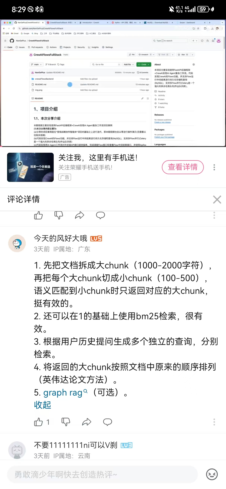

1. step-back的图是否说明我们需要训练一个文本分类模型或者使用api看看score（confident）来判断是more abstract 还是less abstract

# 1030

1. Part11说明，我们在构建vb的时候，需要注意一下metadata，因为我们可以利用metadata来筛选数据 
2. Part13 - RAPTOR：需要注意RAPTOR与以下图片中的做法不同
本方法包含聚类的过程